# I BANDITI RESTAURANT BOOKING SYSTEM

I Banditi is a full‑stack, responsive website built for a fictional restaurant business as part of a portfolio project.

The website allows users to view the menu and, once registered, book, view, edit, and delete table reservations. It is built with Django, Bootstrap 5, and deployed on Heroku with a PostgreSQL database.

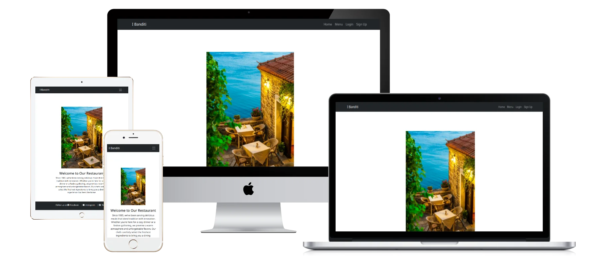

**Live Website:** https://andreaspe-project-4-3264390b1a4b.herokuapp.com/

---

## Table of Contents

- [Overview](#overview)
- [Agile Methodology](#agile-methodology)
- [User Experience (UX)](#user-experience-ux)
  - [Strategy / Site Goals](#strategy--site-goals)
  - [Scope / User Stories](#scope--user-stories)
  - [Structure / Design Choices](#structure--design-choices)
  - [Surface](#surface)
- [Features](#features)
  - [Existing Features](#existing-features)
  - [Future Features](#future-features)
- [Technologies Used](#technologies-used)
- [Testing](#testing)
- [Challenges & Solutions](#challenges--solutions)
- [Bugs](#bugs)
- [Deployment](#deployment)
  - [Forking the GitHub Repository](#forking-the-github-repository)
  - [Creating a Local Clone](#creating-a-local-clone)
- [Credits](#credits)
- [Acknowledgements](#acknowledgements)

---

## Overview

I Banditi is a responsive, mobile‑first restaurant booking system. Users can browse the menu, register for an account, and manage their own reservations.
The project demonstrates full CRUD functionality, authentication, and production‑ready deployment.

---

## Agile Methodology

The project was developed iteratively, using GitHub Issues to track user stories and tasks. Stories were prioritized using the MoSCoW method (Must Have, Should Have, Could Have).
Iterative testing and feedback loops guided refinements until the Minimum Viable Product was achieved.

---

## User Experience (UX)

### Strategy / Site Goals

- Provide a simple, intuitive booking system for customers.
- Ensure responsive design across devices.
- Deliver a professional, production‑ready deployment.

### Scope / User Stories

**As a User**

- Register an account to access the booking system.
- Log in/out securely.
- Create, view, edit, and delete my reservations.
- Receive clear success/error messages.
- Access the site on mobile, tablet, and desktop.

**As an Administrator**

- See all the bookings in the admin panel.
- Be able to edit or delete user bookings.
- Prevent the users from making bookings with dates in the past.

**As a Developer**

- Ensure static assets are cached correctly.
- Pass Lighthouse and W3C validation.
- Keep production secure with `DEBUG=False`.

---

## Structure / Design Choices

- **Navigation**: Responsive navbar with logo, links to Home, Menu, Bookings, Register/Login/Logout.

  

  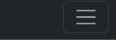

    

- **Footer**: Social links, consistent across all pages.

  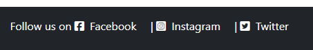

    

- **Home Page**: Hero section with CTA buttons to Menu and Bookings.

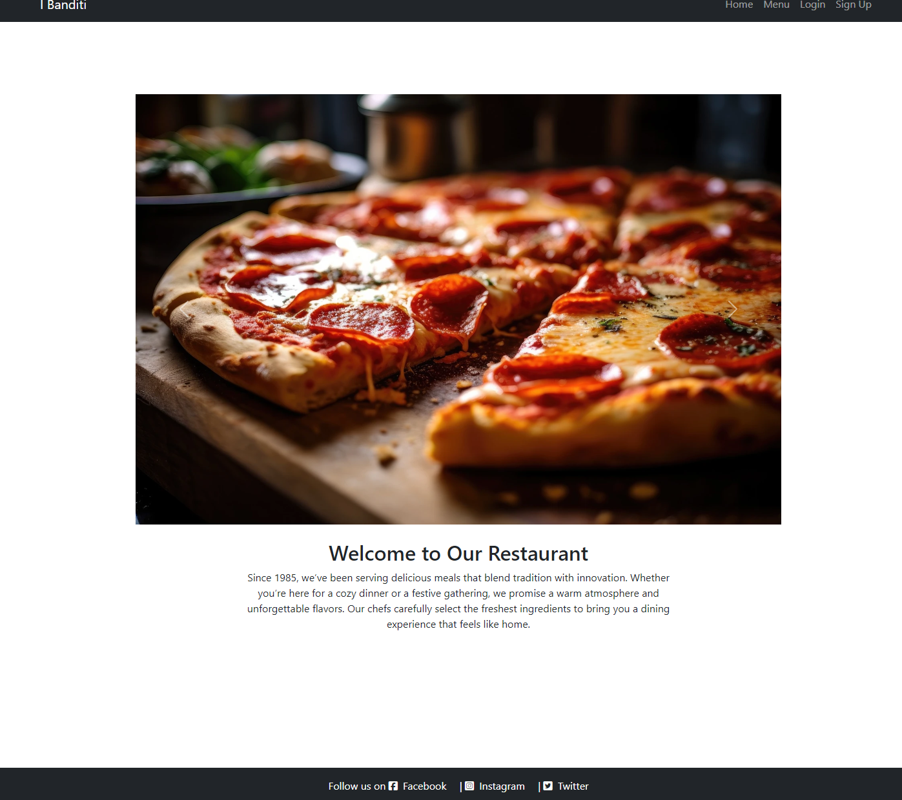

  

- **Menu Page**: Categorized dishes, dish description and pricing.

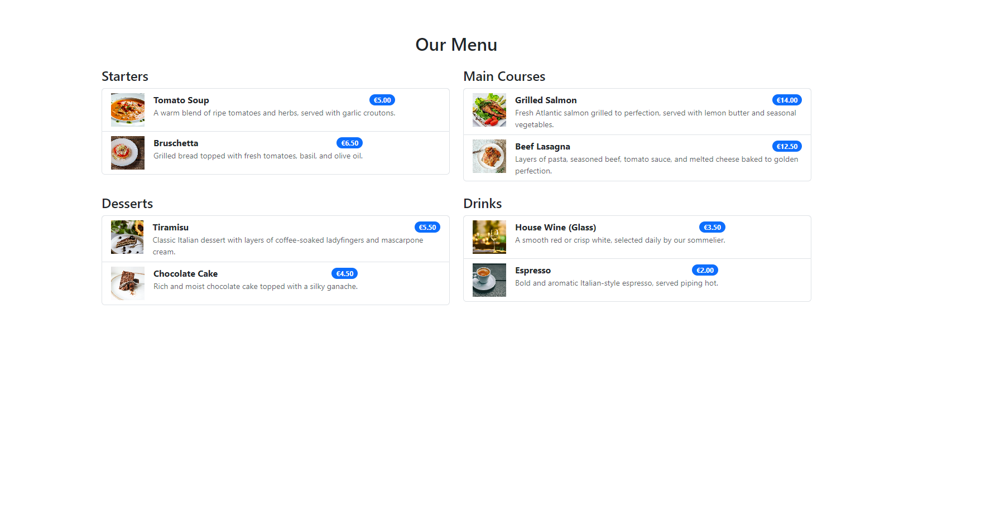

  

- **Authentication**: Register, Login, Logout via Django Allauth

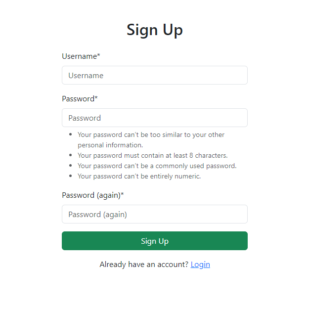

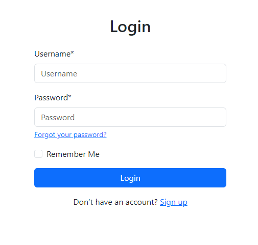

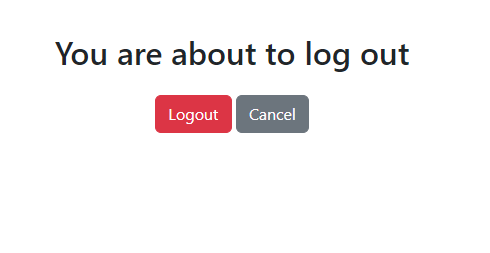

  

- **Booking Pages**: CRUD functionality for logged‑in users.

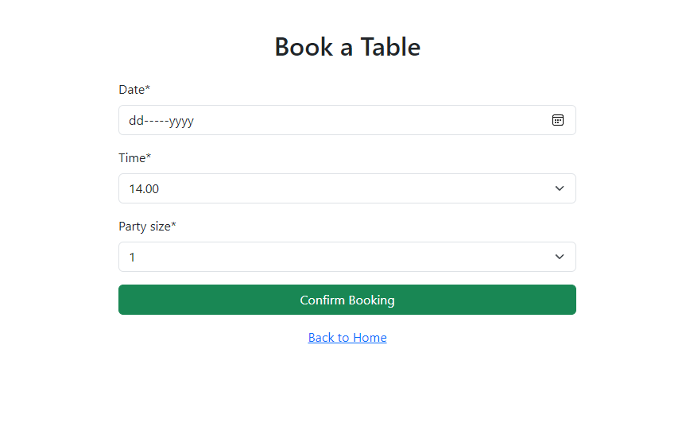

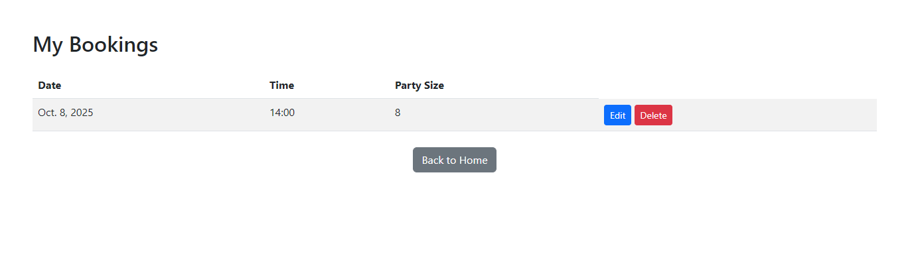

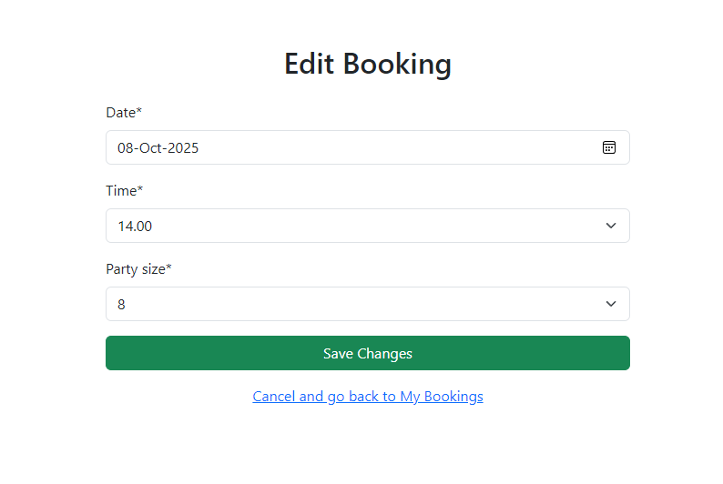

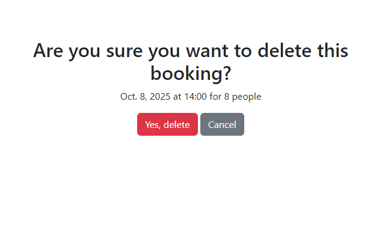

---

## Surface

- **Colour Scheme**: Neutral background with Bootstrap accent colours.
- **Typography**: Sans‑serif fonts for readability.
- **Icons**: Font Awesome/Bootstrap icons for social links and navigation.
- **Accessibility**: Improved via Lighthouse audits, ARIA labels, and alt text

---

## Features

### Existing Features

- Responsive navigation and footer.
- Home page with hero and CTAs.
- Menu page with categories.
- User authentication (Register, Login, Logout).
- Booking system (Create, Read, Update, Delete).
- Validation on booking forms (dates, time, number of guests).
- Prevent users from making a booking in the past.
- Prevent users from seeing and editing other users bookings.
- Sign out users upon browser close or after 30 minutes.

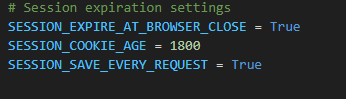

  

- Success/error messages.

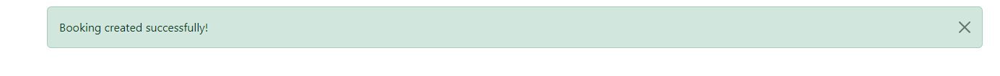

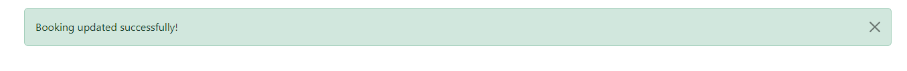

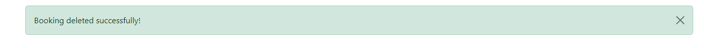

  

- Django Admin panel for superusers.

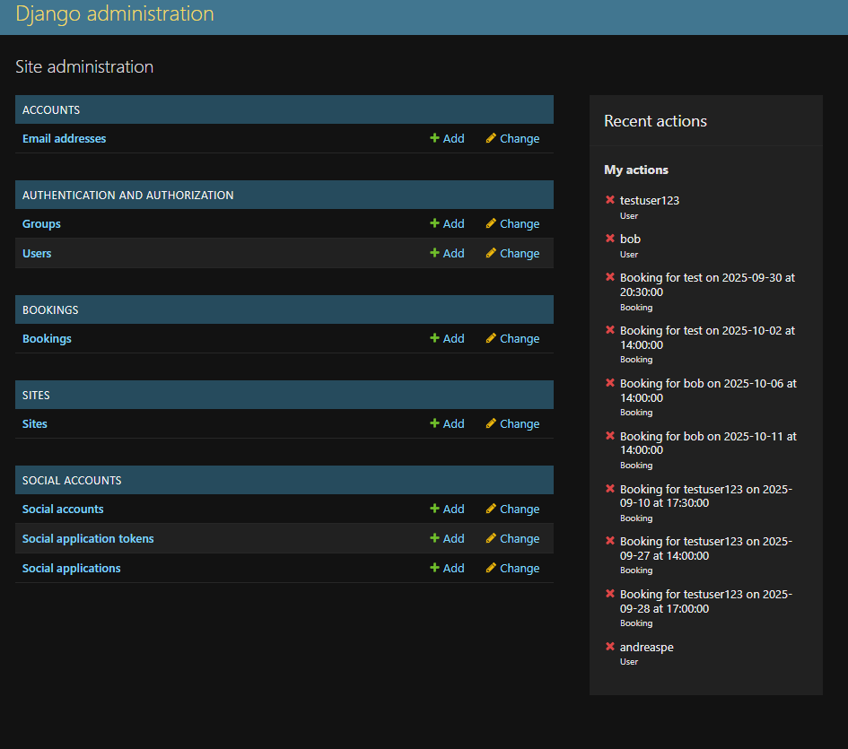

### Future Features

- Custom admin dashboard outside Django admin.
- Email confirmations/reminders.
- Password reset functionality.
- Customer reviews/testimonials.
- Prevent double booking.
- Able to signup with email.

---

## Technologies Used

**Languages**: HTML5, CSS3, Python

- HTML5 – Provided the semantic structure of the website, ensuring accessibility and compatibility across browsers.
- CSS3 – Used for styling, layout, and responsive design, with Bootstrap classes supplemented by custom CSS tweaks.
- Python 3 – The core programming language used with Django to handle backend logic, form validation, and database interactions.

  

**Frameworks/Libraries**: Django 4.x, Bootstrap 5, Django Allauth, WhiteNoise, Gunicorn, Psycopg2

- Django 4.x – The main web framework, providing the MVC structure, ORM for database queries, authentication system, and built‑in admin panel.
- Bootstrap 5 – Frontend framework used for responsive grid layout, navigation bar, buttons, and form styling.
- Django Allauth – Simplified user authentication and registration, handling login, logout, and account management securely.
- WhiteNoise – Enabled efficient serving of static files (CSS, JS, images) directly from Django in production, with cache‑control headers.
- Gunicorn – A WSGI HTTP server used to run the Django application on Heroku.
- Psycopg2 – PostgreSQL database adapter for Python, allowing Django to communicate with the production database.

  

**Database**: PostgreSQL (Heroku)

- PostgreSQL (Heroku) – Relational database used in production. Hosted via Heroku’s Postgres add‑on, replacing the default SQLite used in local development.

  

**Tools**: GitHub, VS Code, Heroku, W3C Validators, Lighthouse, Chrome DevTools, Pexels/Pixabay (images)

- GitHub – Version control and repository hosting, also used for issue tracking and Agile methodology (user stories, Kanban board).
- VS Code – Local development environment, with integrated terminal and extensions for Python/Django.
- Heroku – Cloud platform used for deployment, environment variable management, and database hosting.
- W3C HTML & CSS Validators – Ensured semantic, standards‑compliant markup and styling.
- Lighthouse (Chrome DevTools) – Audited performance, accessibility, SEO, and best practices, guiding improvements.
- Chrome DevTools – Used extensively for debugging layout issues, testing responsiveness, and inspecting network requests.
- Pexels / Pixabay – Sources of royalty‑free images used in the project (hero images, menu illustrations).

---

## Testing

- **Lighthouse**: Passed performance, accessibility, best practices, SEO.

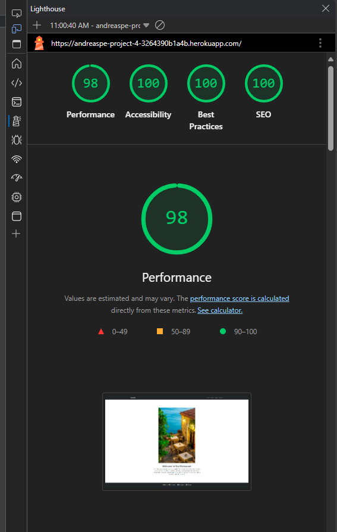

  

- **W3C HTML & CSS Validators**: No errors.

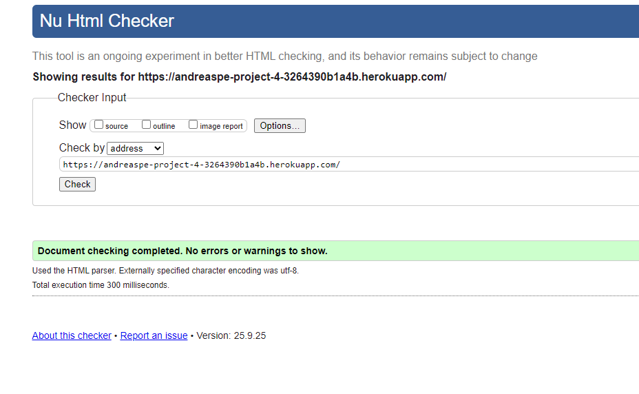

**Validation Link:** https://validator.w3.org/nu/?doc=https%3A%2F%2Fandreaspe-project-4-3264390b1a4b.herokuapp.com%2F/

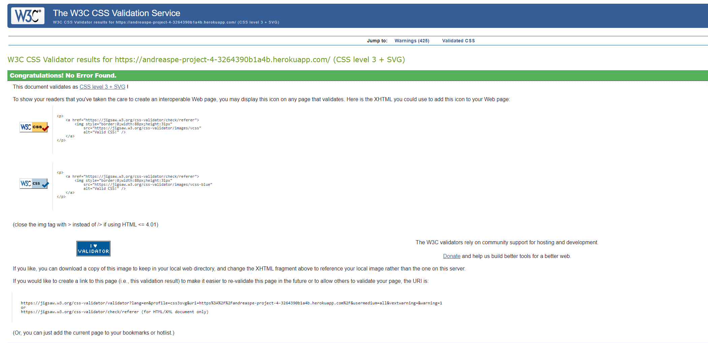

**Validation Link:** https://jigsaw.w3.org/css-validator/validator?uri=https%3A%2F%2Fandreaspe-project-4-3264390b1a4b.herokuapp.com%2F&profile=css3svg&usermedium=all&warning=1&vextwarning=&lang=en/

  

- **Cross‑browser/device**: Tested on Chrome, Edge, Safari, mobile devices.

- **Functional testing**:

  - Register/Login/Logout works as expected.
  - Booking CRUD tested.
  - Validation prevents past dates, booking during no working hours, invalid number of guests.
  - Bookings can be accessed, edited and deleted from the Django admin panel.

---

## Challenges & Solutions:

- **Preventing Users from Booking in the Past.**
- Challenge: Initially, the reservation form allowed users to select any date, including past dates. This would have made the booking system unrealistic and potentially confusing.
- Solution: I implemented custom validation logic in the form to restrict the date field. The validation checks that the chosen date is today or in the future.
- Result: Users can now only book valid dates within the allowed range, ensuring the system reflects real‑world restaurant operations.

  

- **Restricting Access to Other Users’ Bookings.**
- Challenge: By default, Django models and views don’t automatically restrict which records a logged‑in user can see. Without extra logic, one user could potentially view or manipulate another user’s reservations by guessing URLs or IDs.
- Solution: I filtered all booking queries by the currently logged‑in user (request.user). In the views, only reservations belonging to that user are retrieved. Update and delete actions are also restricted so that a user can only edit or cancel their own bookings.
- Result: Each user now has a private booking history. This prevents unauthorized access and ensures data privacy, which is critical for a production‑ready system.

  

- **Implementing Clear Confirmation Messages.**
- Challenge: During early testing, users had no feedback after actions like logging in, logging out, or creating a booking. This made the experience confusing, as it wasn’t clear whether the action had succeeded.
- Solution: I used Django’s built‑in messages framework to display contextual alerts. Success messages appear in the navbar after login, logout, booking creation, update, or cancellation. Error messages are shown inline on forms when validation fails.
- Result: Users now receive immediate, clear feedback for every action. This improves usability and builds trust in the system.

---

## Bugs:

- **Resolved:** dj-database-url not recognised in the virtual environment, booking on a past date possible.

  

- **dj-database-url not recognised in the virtual environment.**
- Symptom: Even though dj-database-url was installed and listed in requirements.txt, Django raised an ImportError when trying to run migrations or start the server.
- Cause: The package was installed globally but not properly registered in the active virtual environment.
- Fix: Reinstalled the package inside the virtual environment with:
   
  **pip install dj-database-url**
   
  **pip freeze > requirements.txt**
   
  Then redeployed to Heroku to ensure the dependency was available in production.
- Result: Django successfully connected to the PostgreSQL database using the parsed DATABASE_URL.

  

- **Booking on a past date possible**
- Symptom: During testing, the reservation form allowed users to select dates that were already in the past. This meant a user could, for example, book a table for “yesterday,” which is not realistic for a restaurant booking system.
- Cause: The initial form and model validation only checked that the date field was a valid date, but did not restrict it relative to the current date.
- Fix: I added custom validation logic in the form’s clean_date method to ensure that:
   
  The booking date must be today or later.
   
  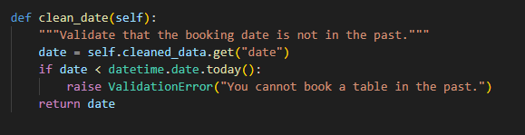
   
  Result: Users can no longer make bookings in the past. The form now enforces realistic booking behaviour, improving both data integrity and user experience.

- **Remaining**: Minor button alignment issue (cosmetic, does not affect functionality),
